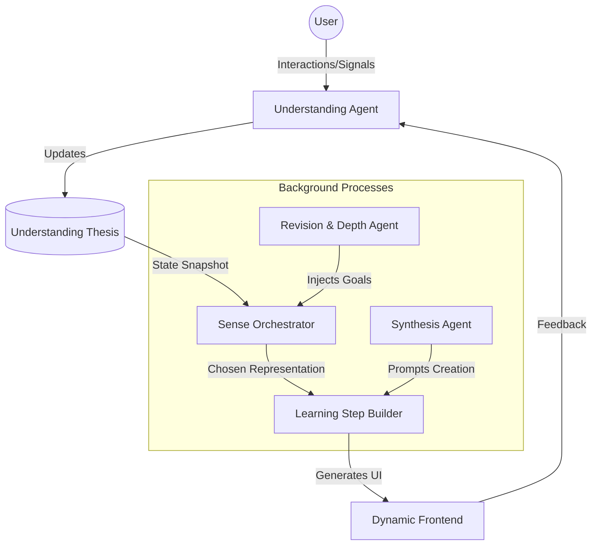

# Polymath: Multi-Agent Learning OS Architecture

## Overview
Polymath is a fluid learning operating system that adapts to the user's mind in real-time. Unlike traditional course platforms that force users down pre-defined linear paths, Polymath uses a swarm of autonomous agents to construct a personalized cognitive environment.

This document outlines the architecture for building this multi-agent system within the existing Electron/Next.js/Monorepo structure.

## Core Philosophy
1.  **No Curriculums**: Knowledge is a graph, not a line.
2.  **Disposable UI**: Interfaces are generated just-in-time for the specific learning moment, then discarded.
3.  **State-First**: All agents coordinate via a shared, evolving "Understanding Thesis" of the user.

---

## System Architecture

The system operates on a **Observe -> Orient -> Decide -> Act (OODA)** loop, mediated by the agents.



### 1. The Shared State: "Understanding Thesis"
This is the single source of truth. It is not just a database of completed modules, but a probabilistic model of the user's mind.
*   **Structure**: Directed Acyclic Graph (DAG) of concepts.
*   **Node Properties**: 
    *   `confidence` (0.0 - 1.0)
    *   `decay_rate` (For spaced repetition)
    *   `preferred_sense` (Visual, Textual, Abstract, Concrete)
    *   `last_interaction_timestamp`

---

## Agent Specifications

### 1. Understanding Agent (The Observer)
*   **Role**: Updates the Understanding Thesis based on user behavior.
*   **Inputs**:
    *   **Direct**: Quiz answers, self-reported confidence.
    *   **Indirect**: Time spent on a card, mouse hover patterns, abandoning a topic, switching windows.
*   **Logic**: 
    *   "User spent 3s on this complex diagram -> Likely didn't grasp it OR already knew it."
    *   "User correctly answered a synthesis question -> Propagate confidence up the concept graph."
*   **Output**: Updates to `UnderstandingThesis` nodes.

### 2. Sense Orchestrator Agent (The Strategist)
*   **Role**: Decides *how* to teach the next concept.
*   **Logic**:
    *   If `User.energy` is low -> Show a high-level video or story.
    *   If `User.confidence` is shaky -> Usage concrete analogy.
    *   If `User.focus` is high -> Show raw documentation or academic paper.
*   **Output**: A `LearningStepConfig` object (e.g., `{ concept: "Entropy", representation: "InteractiveSimulation", complexity: "High" }`).

### 3. Learning Step Builder Agent (The Architect)
*   **Role**: Generates the actual UI code or schema for the requested step.
*   **Logic**: Uses the `LearningStepConfig` to prompt an LLM to generate React components or select from a library of dynamic templates. 
    *   *Note: In the early MVP, this picks from a rich library of layouts (`experiments`, `text_columns`, `video_focus`). In v2, it writes React code via `rsc`.*
*   **Output**: JSON Schema for the UI or React Server Component payload.

### 4. Revision & Depth Agent (The Gardener)
*   **Role**: Runs in the background to prevent decay and encourage mastery.
*   **Logic**: Monitors the `UnderstandingThesis` for decaying knowledge. Intercepts the `Sense Orchestrator` to inject review steps or "Deep Dives" (connecting two seemingly unrelated known concepts).
*   **Output**: High-priority tasks added to the orchestration queue.

### 5. Synthesis Agent (The Mentor)
*   **Role**: Ensures active learning.
*   **Logic**: Detects when consumption is too high vs. creation.
*   **Output**: Prompts for the user: "Explain this to a 5-year-old," "Write a note," "Solve this unguided problem."

---

## Implementation Guide

### Phase 1: Foundation Strategy (Monorepo Integration)
Since this is an Electron/Next.js monorepo:

1.  **Event Bus**: Use a local IPC (Inter-Process Communication) based event bus or an embedded RxJS observable pattern in the Main process to coordinate agents.
2.  **Local vs Cloud**: 
    *   **Logic**: Run agent coordination (LangChain/LangGraph) in the Electron **Main Process** (Node.js).
    *   **Inference**: Use API calls (OpenAI/Anthropic) for heavy lifting, or local ONNX models for the "Understanding Agent" signals (privacy-first).

### Phase 2: Project Structure Recommendation

Create a new package `@polymath/brain`:

```text
packages/
  brain/
    src/
      agents/
        understanding/
        orchestrator/
        builder/
        revision/
        synthesis/
      core/
        thesis.ts       # Validated State Machine
        memory.ts       # Vector Store (SQLite/Chroma)
      types/
    index.ts
```

### Phase 3: Step-by-Step Build Plan

#### Step 1: Define the `UnderstandingThesis` Schema
Before building agents, define the state they manipulate.
*   Create a Zod schema for `UserKnowledgeState`.
*   Implement a simple graph database (SQLite + JSON or a graph lib like `graphology`).

#### Step 2: Build the "Sense Orchestrator" (The Router)
*   Implement a function that looks at the `UnderstandingThesis` and returns a `NextAction`.
*   Start simple: "If confidence < 0.5, show Explanation. If confidence > 0.8, show Quiz."

#### Step 3: Experimental "Learning Step Builder"
*   Instead of generating code, create 5-10 flexible React layouts in `apps/desktop`.
*   The Agent simply selects the Layout + Content.
*   *Prompt*: "You are explaining [Topic]. The user is [Beginner]. Generate the text and choose the best layout from [list-of-layouts]."

#### Step 4: The Feedback Loop (Understanding Agent)
*   Hook into the UI events in `renderer.ts`.
*   Send stream of events (`SCROLL`, `PAUSE`, `CLICK`) to the Main process.
*   Write a heuristic function to update the thesis based on these.

### Tech Stack Recommendations
*   **Orchestration**: LangGraph (JS version) - perfect for stateful multi-agent workflows.
*   **Memory**: PGLite (Postgres in WASM) or SQLite for local vector/relational storage.
*   **LLM**: DeepSeek-v3 or GPT-4o for logic (API), Llama-3-8b quantized (Local) for constant privacy-preserving monitoring.

## Example Workflow Trace

1.  **User** launches app.
2.  **Understanding Agent** loads state: "User knows `React` (High), `State Machines` (Low)".
3.  **Revision Agent** flags `State Machines` for review.
4.  **Sense Orchestrator** sees the flag. Decides: "Representation = Interactive Diagram".
5.  **Learning Step Builder** receives request. Generates content for `<XStateViz />` component.
6.  **UI** renders the interactive state machine diagram.
7.  **User** plays with it for 45 seconds, clicks "Reset" twice.
8.  **Understanding Agent** interprets "Reset attempts" as "Confusion". Lowers confidence score.
9.  **Sense Orchestrator** adapts immediately: "Next step -> Socratic Text Explanation (Simpler)."
